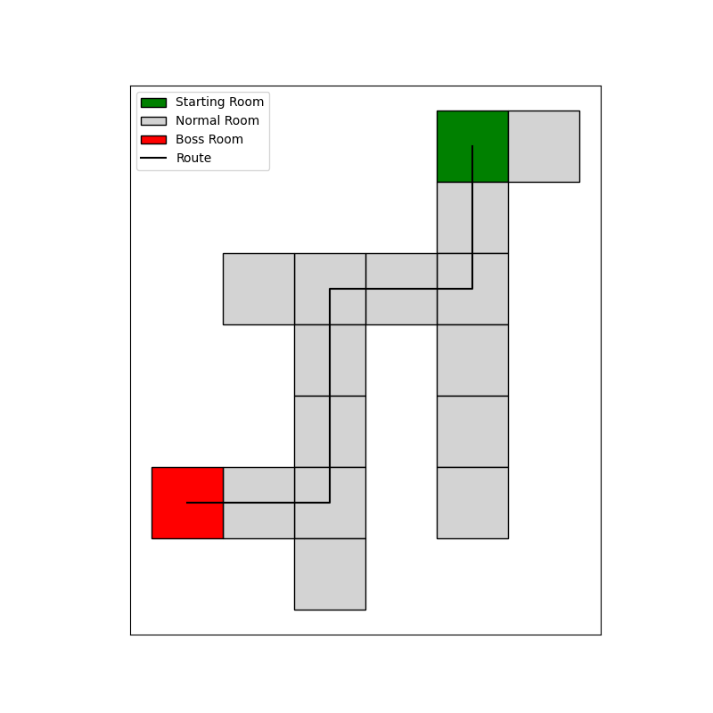

# Binding of Isaac Level Generation for Monitoring Sinvicta-Navigation

{width=50% style="display: block; margin: 0 auto"}

This is an example of the level generation found in pre-Repentance Isaac. The idea behind this was to aid the community in finally determining whether Sinvicta-navigation is really a thing.

## Usage

I recommend the use of a virtual environment for playing with this. As a note, this was developed with Python 3 and the following commands are all for that version of the language. To deploy you will just need to run the following:

```
git@github.com:SkinnyPigeon/isaac-levelgen.git
cd isaac-levelgen
python -m pip install -r requirement.txt
```

This last command will install `matplotlib` plus its dependent libraries. You'll now be able to either run either of the main files.

### Visualizing the levels

To visualize the levels you can call the following:

```
python display.py
```

This will generate a level map complete with a start room and a boss room plus show the route through the level to get to the boss. To change the size of the level, you can alter the call to the `room_count` function on line 63 of `display.py`. See the docs for this function on how to adjust the parameters.


### Running a Monte Carlo Simulation

To run the MCS you can call the following:

```
python grid_coords.py
```

This will perform an MCS on the level generation and boss route calculation that will produce an average number of rooms that must be cleared for a given level. Currently it is set to 10,000 which gives fairly steady results, however, you are welcome to adjust this by altering this value on line 170 of `grid_coords.py`. Additionally, you can alter the number of rooms in the floor by adjusting the call to the `room_count` function on line 179 of the same file. Again, see the docs for this function on how to adjust the parameters.


## Notes

- This is by no means perfect. It is just a rough draft to help the community in case it is needed. The level generation is based on two sources of information. These are from the [wiki](https://bindingofisaacrebirth.fandom.com/wiki/Level_Generation) and a [nice blog post](https://www.boristhebrave.com/2020/09/12/dungeon-generation-in-binding-of-isaac/). I've tried to follow the rules laid out as best I can (in a very short time). 

- One issue I've noticed is that it does not do Isaac-loops which is curious and would need to be fixed.

- I imagine that for this to be of use, it would we would likely need to extend it to include deliberate trips to the shop/item/curse rooms

- To further extend it, it would likely need to be paired with some image recognition magicks to evaluate past runs to count how many rooms Sinvicta actually does use. My money would be on an image classifier that increments a room count on screen transitions